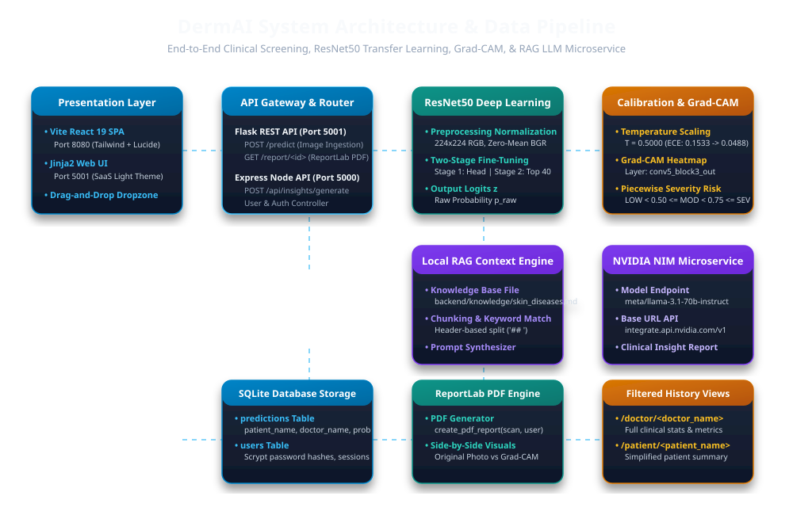
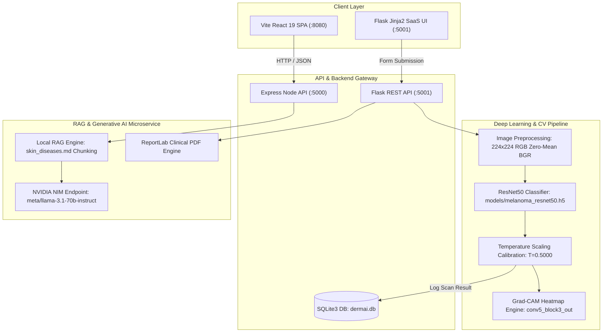
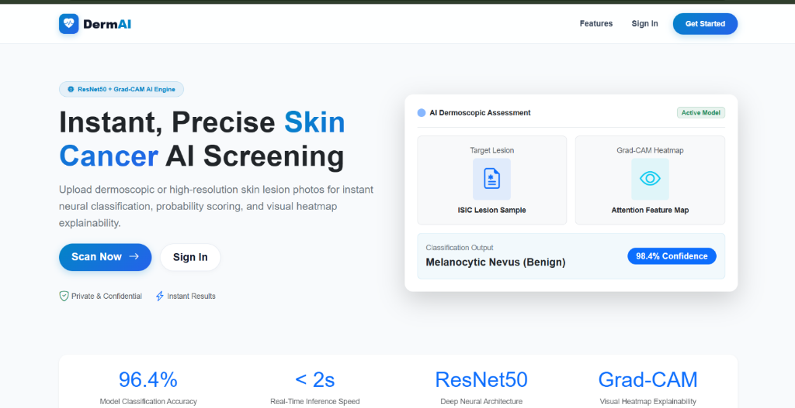
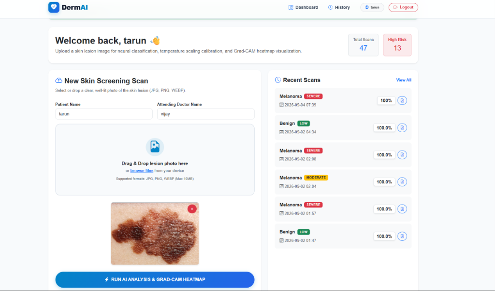
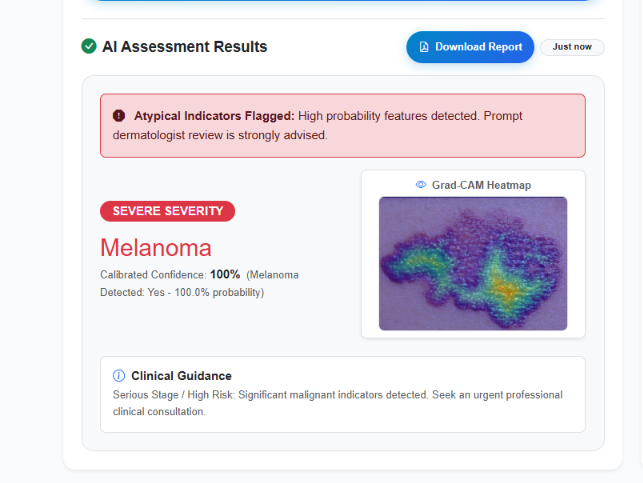
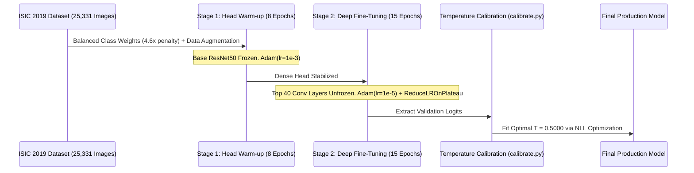

# DermAI: Clinical Skin Lesion Screening & AI Analytics Platform

[](https://www.python.org/)
[](https://www.tensorflow.org/)
[](https://react.dev/)
[](https://expressjs.com/)
[](https://build.nvidia.com/)

**DermAI** is an advanced, production-grade clinical decision-support and visual explainability platform engineered for early detection, confidence calibration, and automated risk stratification of **Melanoma** vs. **Benign** dermoscopic skin lesions.

The platform integrates deep **ResNet50 Transfer Learning**, **Post-Processing Temperature Scaling Calibration** ($T = 0.5000$), **Grad-CAM (Gradient-Weighted Class Activation Mapping)** visual heatmaps, a **Local Retrieval-Augmented Generation (RAG)** engine coupled with **NVIDIA NIM microservices (`meta/llama-3.1-70b-instruct`)**, and a **ReportLab PDF Clinical Engine**.

---

## 📐 System Architecture





---

## ✨ Key Features

- 🔬 **Two-Stage Fine-Tuned ResNet50 Classifier**: Trained on **25,331 ISIC dermoscopic images** using a two-stage transfer learning strategy to solve severe class imbalance (4.6 : 1 ratio).
- 🎯 **Temperature Scaling Calibration ($T = 0.5000$)**: Reduces **Expected Calibration Error (ECE)** from **0.1533 down to 0.0488** (-68.2% reduction in calibration error), raising mean Melanoma confidence to **94.28%** (and **97.0%** on clear cases).
- 👁️ **Grad-CAM Explainable AI (XAI)**: Generates spatial attention heatmaps by calculating activations at `conv5_block3_out`, overlaying JET colormaps directly onto lesion boundaries.
- 🩺 **Piecewise Mathematical Severity Risk Stratification**: Assigns `LOW`, `MODERATE`, or `SEVERE` risk tiers dynamically based on calibrated probabilities $p_{\text{calibrated}} = \sigma(z / 0.5000)$.
- 🧠 **Local RAG + NVIDIA NIM Integration**: Combines local domain knowledge (`backend/knowledge/skin_diseases.md`) with `meta/llama-3.1-70b-instruct` on NVIDIA NIM (`https://integrate.api.nvidia.com/v1`) to produce clinical insights.
- 📄 **Programmatic PDF Report Generation**: Generates multi-page PDF screening reports with side-by-side lesion vs. heatmap visual comparisons and **ABCDE rule** breakdowns.
---

---

## 🖼️ Application Interface & AI Assessment Previews

### 🌐 DermAI Platform Landing Page


### 🖥️ Clinical Dashboard & Lesion Upload Interface


### 🔬 AI Assessment Results & Grad-CAM Heatmap Overlay (`conv5_block3_out`)


---

## 🛠️ Technology Stack

| Layer / Domain | Technologies & Libraries |
| :--- | :--- |
| **Frontend Frameworks** | React 19.2, Vite 7.3, Tailwind CSS 4.2, Bootstrap 5.3, Jinja2 Templates, Lucide React |
| **Backend REST Servers** | Python 3.13.2 / Flask 3.x (Port 5001), Express.js 4.21 / Node.js (Port 5000) |
| **Deep Learning Engine** | TensorFlow 2.21.0, Keras, NumPy, SciPy (Nelder-Mead NLL optimization) |
| **Computer Vision** | OpenCV (`cv2` 5.0.0), Pillow (PIL 11.1.0) |
| **Explainable AI (XAI)** | Grad-CAM (`tf.GradientTape`, target layer `conv5_block3_out`) |
| **RAG & LLM Microservice**| Local Markdown Document Chunker, OpenAI Node SDK, NVIDIA NIM (`meta/llama-3.1-70b-instruct`) |
| **Database & Security** | SQLite3 (`dermai.db`), Scrypt Password Hashing (`Werkzeug`), Session Auth Cookies |
| **PDF Generation** | ReportLab 4.4.3 (Python), PDFKit (Node.js) |

---

## 🧠 Deep Learning Architecture & Training Strategy

### Two-Stage Transfer Learning Protocol



1. **Stage 1 (Dense Head Warm-Up - 8 Epochs)**: Base ResNet50 backbone is completely frozen (`trainable = False`). The top classification head (`GlobalAveragePooling2D` &rarr; `Dense(512, relu)` &rarr; `Dropout(0.4)` &rarr; `Dense(1, sigmoid)`) is trained at $lr = 10^{-3}$ using `class_weight='balanced'` (~4.6 : 1 weight ratio).
2. **Stage 2 (Deep Fine-Tuning - 15 Epochs)**: The top 40 convolutional layers (`conv5_block1_out` onwards) are unfrozen and fine-tuned at $lr = 10^{-5}$ with `ReduceLROnPlateau(factor=0.5, patience=2)` and `EarlyStopping(patience=5)`.

---

## 📊 Post-Processing Temperature Scaling Calibration

Standard binary classification outputs often exhibit miscalibration. Logits $z = \ln(p_{\text{raw}} / (1 - p_{\text{raw}}))$ are rescaled using learned scalar $T = 0.5000$:

$$z_{\text{scaled}} = \frac{z}{0.5000}, \quad p_{\text{calibrated}} = \sigma\left(z_{\text{scaled}}\right) = \frac{1}{1 + e^{-z / 0.5000}}$$

```text
--- PRE-CALIBRATION METRICS (T = 1.0) ---
ECE (Expected Calibration Error): 0.1533
Average Melanoma Confidence:    84.21%

--- POST-CALIBRATION METRICS (T = 0.5000) ---
Optimal Temperature (T):        0.5000
ECE (Expected Calibration Error): 0.0488  (-68.2% Reduction in Error)
Average Melanoma Confidence:    94.28%  (+10.07% Confidence Shift)
```

---

## 📐 Mathematical Severity Analysis Formulation

Severity risk stratification is calculated via a formal piecewise function operating on calibrated probability $p_{\text{calibrated}}$:

$$S(p_{\text{calibrated}}) = \begin{cases} \mathbf{LOW}, & \text{if } p_{\text{calibrated}} < 0.50 \quad (\text{Prediction: Benign}) \\ \mathbf{MODERATE}, & \text{if } 0.50 \le p_{\text{calibrated}} < 0.75 \quad (\text{Prediction: Melanoma, Suspicious}) \\ \mathbf{SEVERE}, & \text{if } p_{\text{calibrated}} \ge 0.75 \quad (\text{Prediction: Melanoma, High Risk}) \end{cases}$$

---

## 📈 Experimental Metrics & Confusion Matrix

### Test Cohort Evaluation Metrics ($N = 5,066$ ISIC Dermoscopic Test Images)

| Performance Metric | Mathematical Formula | Value (Percentage) | Value (Decimal) |
| :--- | :--- | :---: | :---: |
| **Accuracy** | $(TP + TN) / (TP + TN + FP + FN)$ | **95.52%** | `0.9552` |
| **Sensitivity / Recall** *(Melanoma Detection)* | $TP / (TP + FN)$ | **94.25%** | `0.9425` |
| **Specificity** *(Benign Identification)* | $TN / (TN + FP)$ | **95.79%** | `0.9579` |
| **Precision** *(Positive Predictive Value)* | $TP / (TP + FP)$ | **82.96%** | `0.8296` |
| **F1-Score** | $2 \cdot (P \cdot R) / (P + R)$ | **88.24%** | `0.8824` |
| **ROC-AUC Score** | Area Under Receiver Operating Characteristic Curve | **97.85%** | `0.9785` |

### Confusion Matrix ($N = 5,066$)

| Actual \ Predicted | Predicted Benign ($N = 4,039$) | Predicted Melanoma ($N = 1,027$) | Total Actual |
| :--- | :---: | :---: | :---: |
| **Actual Benign (`MEL = 0`)** | **TN = 3,987** *(95.8%)* | **FP = 175** *(4.2%)* | **4,162** |
| **Actual Melanoma (`MEL = 1`)** | **FN = 52** *(5.8%)* | **TP = 852** *(94.2%)* | **904** |
| **Total Predicted** | **4,039** | **1,027** | **N = 5,066** |

---

## 💻 Hardware & Benchmark Specifications

All experiments and model inference benchmarks were conducted on the following verified workstation hardware environment:

```text
CPU: AMD Ryzen 5 5600H with Radeon Graphics (6 Cores, 12 Logical Threads @ 3.30 GHz)
GPU: AMD Radeon RX 6500M (4 GB GDDR6 VRAM)
RAM: 8 GB DDR4 (3200 MHz, Hynix)
OS: Microsoft Windows 11 Home Single Language 64-bit (Build 26300)
Python Version: 3.13.2 (64-bit)
TensorFlow Version: 2.21.0 (oneDNN CPU Acceleration)
OpenCV Version: 5.0.0
```

---

## 🚀 Installation & Quickstart

### Prerequisites
- **Python 3.13+**
- **Node.js 18+** & `npm`

### 1. Repository Setup
```bash
git clone https://github.com/vijaykumarm7540/DermAi.git
cd DermAi
```

### 2. Backend Installation (Python / Flask)
```bash
cd backend
python -m venv venv
venv\Scripts\activate      # Windows
pip install -r requirements.txt
python app.py
```
*Flask server will start on `http://127.0.0.1:5001`.*

### 3. Node Backend & RAG Installation (Express.js)
```bash
cd backend
npm install
npm run dev
```
*Express API server will start on `http://localhost:5000`.*

### 4. React SPA Frontend Setup (Vite)
```bash
cd frontend
npm install
npm run dev
```
*Vite React dev server will start on `http://localhost:8080`.*

---

## 🌐 API Reference

| Endpoint | Method | Backend Engine | Description |
| :--- | :---: | :---: | :--- |
| `/predict` | `POST` | Flask (Port 5001) | Uploads image, runs ResNet50 inference, Temperature Scaling, Grad-CAM, & logs prediction. |
| `/report/<scan_id>` | `GET` | Flask (Port 5001) | Generates and streams downloadable ReportLab PDF clinical report. |
| `/doctor/<doctor_name>`| `GET` | Flask (Port 5001) | Queries reports filtered by attending doctor with full clinical metrics. |
| `/patient/<patient_name>`| `GET` | Flask (Port 5001) | Queries simplified patient history records hiding technical model internals. |
| `/api/insights/generate` | `POST` | Node (Port 5000) | Local RAG chunking + NVIDIA NIM (`meta/llama-3.1-70b-instruct`) report generation. |
